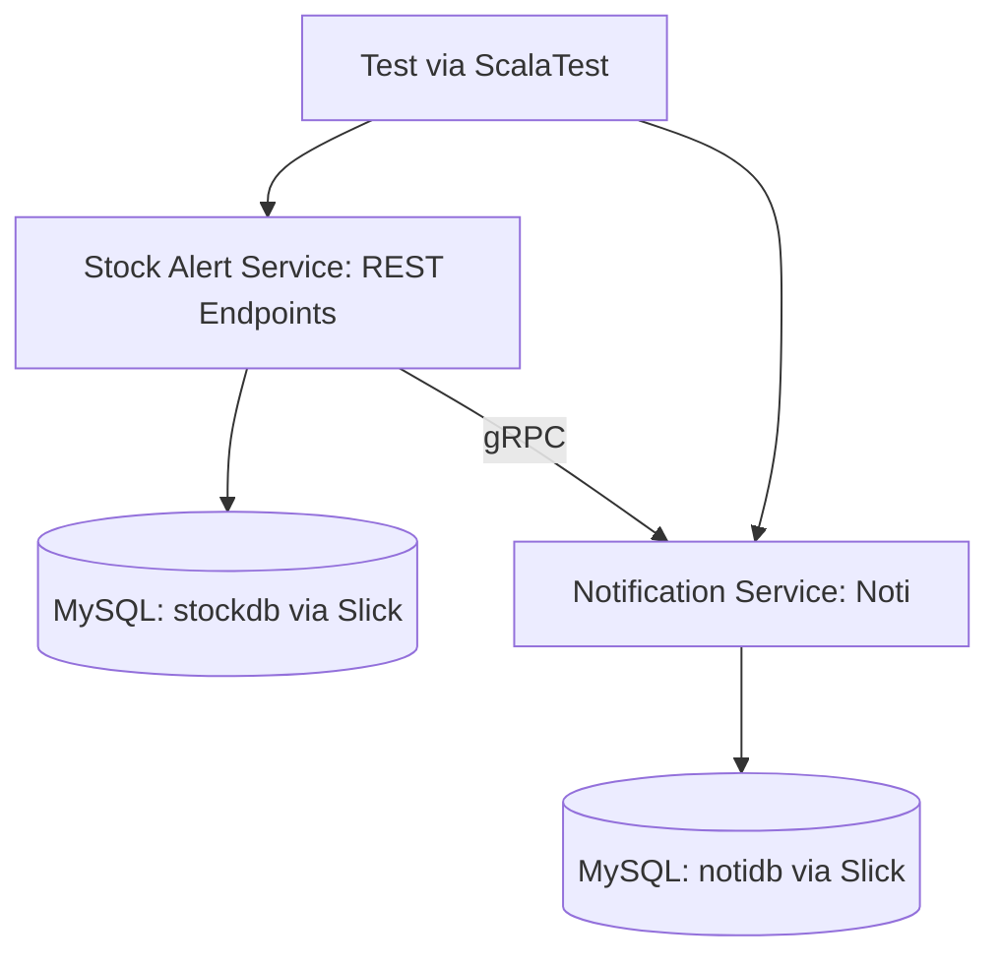

# 🏷 Stock Alert System (Microservices)🛒

A microservice system built in Scala:

## Stock Alert Service (stock-alert)

The Stock Alert Service is responsible for managing items, orders, users, and monitoring stock levels. When stock falls below the minimum threshold, it triggers notifications to users via gRPC.

### Restock Functionality

The Restock feature ensures that users are notified when stock levels are low.
When an order would reduce an item's stock below its `minStock`, a Restock entry is created with `itemId` and the `userId` of affected users.
Once the item is restocked, all affected users’ notifications are updated, informing them that the item is available again.
This helps maintain proactive communication with users and improves order fulfillment for popular or limited-stock items.

### Security

* **Authentication:** JWT-based authentication. During login, a token is generated and returned to the client.
* **Authorization:** Role-based authorization is enforced on each endpoint using the user’s `role` field:

  * `Admin` – CSRF token retrieval.
  * `Seller` – Add items and update item stock.
  * `Customer` – Browse items and place orders (Categories as prime, non-prime users).
* **Token usage:** Every request to protected endpoints must include the JWT token in the `Authorization` header. The server validates the token and extracts the user’s role to authorize actions.
* **Role enforcement:** Each endpoint explicitly checks the role and responds with `403 Forbidden` if the user is unauthorized.

---

## Notification Service (noti)

gRPC server (Play Framework) that receives low-stock alerts and stores notifications in a MySQL database.

---

## Architecture Overview

REST endpoints for items, orders, users, and restock requests.
Slick + Evolutions for database interaction.
gRPC communication with Notification Service.
ScalaTest for unit/integration tests.

### Architecture Flow (Mermaid Diagram)



---

## Tech Stack

| Component     | Technology                 |
| ------------- | -------------------------- |
| Language      | Scala                      |
| Frameworks    | Play Framework, ScalaPB    |
| DB Access     | Slick + Evolutions (MySQL) |
| Communication | gRPC via ScalaPB stubs     |
| Testing       | ScalaTest + Mockito        |
| Containers    | Docker + Docker Compose    |

---

## Database Tables

### 1. Users Table

| Column Name   | Data Type             | Description                            |
| ------------- | --------------------- | -------------------------------------- |
| id            | BIGINT AUTO_INCREMENT | Primary key                            |
| name          | VARCHAR               | User name                              |
| email         | VARCHAR               | User email (unique)                    |
| password      | VARCHAR               | User password                          |
| phone         | VARCHAR               | User phone number                      |
| notifications | VARCHAR               | Comma-separated notifications for user |
| is_prime      | BOOLEAN               | Premium user flag (default FALSE)      |
| role          | VARCHAR               | User role (default 'customer')         |

### 2. Items Table

| Column Name | Data Type             | Description             |
| ----------- | --------------------- | ----------------------- |
| id          | BIGINT AUTO_INCREMENT | Primary key             |
| name        | VARCHAR               | Item name               |
| stock       | BIGINT                | Current stock quantity  |
| minStock    | BIGINT                | Minimum stock threshold |

### 3. Orders Table

| Column Name | Data Type             | Description                      |
| ----------- | --------------------- | -------------------------------- |
| id          | BIGINT AUTO_INCREMENT | Primary key                      |
| item        | BIGINT                | Foreign key referencing Items.id |
| qty         | BIGINT                | Quantity ordered                 |

### 4. Restock Table

| Column Name | Data Type             | Description                      |
| ----------- | --------------------- | -------------------------------- |
| id          | BIGINT AUTO_INCREMENT | Primary key                      |
| itemId      | BIGINT                | Foreign key referencing Items.id |
| userId      | BIGINT                | Foreign key referencing Users.id |

---

## Services & Endpoints

### Stock Alert Service (stock-alert-service)

#### Items

| Method | Endpoint          | Role     | Description       | Example Payload                                   |
| ------ | ----------------- | -------- | ----------------- | ------------------------------------------------- |
| POST   | /items            | Seller   | Create a new item | `{ "name": "Dress", "stock": 10, "minStock": 5 }` |
| GET    | /items            | Customer | List all items    | N/A                                               |
| GET    | /items/:id        | Customer | Get a single item | N/A                                               |
| PUT    | /items/:id/:stock | Seller   | Update item stock | N/A                                               |

#### Orders

| Method | Endpoint | Role     | Description                    | Example Payload                        |
| ------ | -------- | -------- | ------------------------------ | -------------------------------------- |
| POST   | /orders  | Customer | Place an order, reducing stock | `{ "item": 1, "qty": 7 }` |
| GET    | /orders  | Admin    | List all orders                | N/A                                    |

> **Note:** Orders that drop stock below `minStock` trigger a gRPC alert to the Notification Service. Non-prime customers cannot order more than 2 items per order.

#### Users

| Method | Endpoint        | Role                   | Description               | Example Payload                                                                                                      |
| ------ | --------------- | ---------------------- | ------------------------- | -------------------------------------------------------------------------------------------------------------------- |
| POST   | /user           | Public                 | Register a new user       | `{ "name": "John", "email": "john@example.com", "password": "pass123", "phone": "1234567890", "notifications": "" ,"isPrime": true ,"role":"Customer"}` |
| GET    | /user           | Admin                  | List all users            | N/A                                                                                                                  |
| GET    | /user/:id       | Admin                  | Fetch a user by ID        | N/A                                                                                                                  |
| PUT    | /user/:id/phone | Customer (own)         | Update user's phone       | `{ "phone": "0987654321" }`                                                                                          |
| DELETE | /user/:id       | Admin / Customer (own) | Delete a user             | N/A                                                                                                                  |
| POST   | /login          | Public                 | User login (JWT returned) | `{ "email": "John@gmail.com", "password": "pass123" }`                                                                          |

#### CSRF Token

| Method | Endpoint    | Role  | Description      |
| ------ | ----------- | ----- | ---------------- |
| GET    | /csrf-token | Admin | Fetch CSRF token |

---

## Example Workflows with Role Enforcement

### Place Order Below Min Stock (Customer)

POST `/orders` with:

```json
{
  "item": 1,
  "qty": 7
}
```

* JWT token of a `Customer` must be sent in `Authorization` header.
* StockService checks stock → triggers Restock entry.
* gRPC alert sent to Notification Service.

Response:

```json
Order NOT placed. Alert: Order ID LOW STOCK ALERT for item 1, attempted order for qty 7 inserted successfully
```

### Register User (Public)

POST `/user`:

```json
{
  "name": "Rom reign",
  "email": "RR@example.com",
  "password": "123456",
  "phone": "1234567890",
  "notifications": "yes",
  "isPrime" : true,
  "role" : "Customer"

}
```

Response:

```json
{
  "id": 1,
  "message": "User Rom reign registered"
}
```

### User Login (Public)

POST `/login`:

```json
{
  "email": "RR@example.com",
  "password": "123456"
}
```

Response:

```json
{
    "token": "HS256 token will be generated here"
}
```

### Update User Phone (Customer)

PUT `/user/1/phone`:

```json
{
  "phone": "0987654321"
}
```

Response:

```json
{
  "id": 1,
  "message": "Phone number updated"
}
```

### Update Item Stock (Seller)

PUT `/items/1/15`

Response:

```json
{
  "id": 1,
  "message": "Stock updated to 15"
}
```

### Get All Users (Admin)

GET `/user`

Response:

```json
[
  {
    "id": 1,
    "name": "John",
    "email": "john@example.com",
    "role": "Customer"
  },
  {
    "id": 2,
    "name": "Alice",
    "email": "alice@example.com",
    "role": "Seller"
  }
]
```

---

## Testing

ScalaTest covers controllers, services, and gRPC interaction.
Example: ordering below `minStock` should assert that Notification Service is invoked (mocked).

Run tests:

```bash
sbt test
```

---

## Running with Docker Compose

```bash
docker-compose up --build
```

This brings up:

* `stock-alert-service` at localhost:9002 (REST)
* `noti` service for notifications via gRPC and REST at localhost:9001

Endpoints:

* Stock: `/items`, `/orders`
* Users: `/user`, `/login`
* Notifications: `/notifications`

---

## Project Structure


```
├── stock-alert
│   ├── app
│   │   ├── controllers
│   │   ├── models
│   │   ├── repositories
│   │   ├── services
│   │   └── modules
│   ├── docker-compose.yml
│   ├── Dockerfile (for each service)
│   ├── conf
│   ├── test
│   └── build.sbt
├── noti
│   ├── src\main\scala\shared\notification
│   │   ├── repositories
│   │   ├── services
│   │   └── NotificationServer
│   ├── docker-compose.yml
│   ├── Dockerfile (for each service)
│   ├── conf
│   ├── test
│   └── build.sbt
├── .github/workflows
│   └── ci.yml
└── README.md
```

---

## Contribution

1. Fork the repo
2. Create your feature branch
3. Run tests locally
4. Commit and push :-)