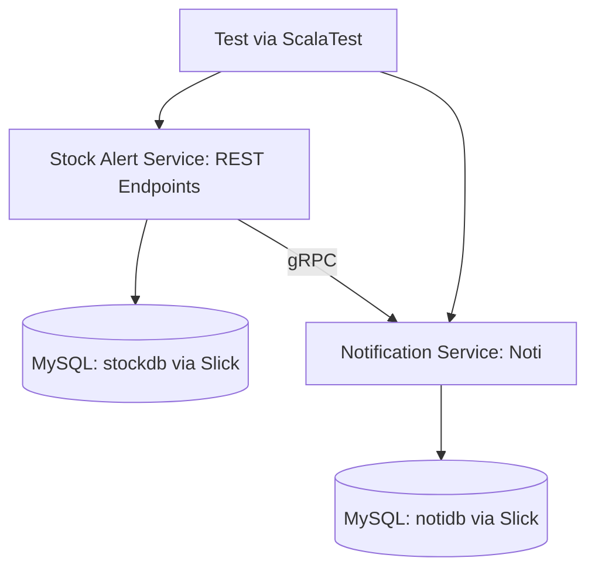

# 🏷 Stock Alert System (Microservices)🛒

A microservice system built in Scala:

## Stock Alert Service (stock-alert)

The Stock Alert Service is responsible for managing items, orders, customers, and monitoring stock levels. When stock falls below the minimum threshold, it triggers notifications to customers via gRPC.

### Restock Functionality

The Restock feature ensures that customers are notified when stock levels are low.
When an order would reduce an item's stock below its minStock, a Restock entry is created with itemId and the customerId of affected customers.
Once the item is restocked, all affected customers’ notifications fields are updated, informing them that the item is available again.
This helps maintain proactive communication with customers and improves order fulfillment for popular or limited-stock items.

## Notification Service (noti)

gRPC server (Play Framework) that receives low-stock alerts and stores notifications in a MySQL database.

---

## Architecture Overview

REST endpoints for items, orders, customers, and restock requests.
Slick + Evolutions for database interaction.
gRPC communication with Notification Service.
ScalaTest for unit/integration tests.

### Architecture Flow (Mermaid Diagram)


REST endpoints for items, orders, customers, and restock requests.

Slick + Evolutions for database interaction.

gRPC communication with Notification Service.

ScalaTest for unit/integration tests.

---

## Tech Stack

| Component     | Technology                 |
| ------------- | -------------------------- |
| Language      | Scala                      |
| Frameworks    | Play Framework, ScalaPB    |
| DB Access     | Slick + Evolutions (MySQL) |
| Communication | gRPC via ScalaPB stubs     |
| Testing       | ScalaTest + Mockito        |
| Containers    | Docker + Docker Compose    |

---

## Database Tables

### 1. Items Table

| Column Name | Data Type              | Description             |
| ----------- | ---------------------- | ----------------------- |
| id          | BIGINT AUTO\_INCREMENT | Primary key             |
| name        | VARCHAR                | Item name               |
| stock       | BIGINT                 | Current stock quantity  |
| minStock    | BIGINT                 | Minimum stock threshold |

### 2. Orders Table

| Column Name | Data Type              | Description                          |
| ----------- | ---------------------- | ------------------------------------ |
| id          | BIGINT AUTO\_INCREMENT | Primary key                          |
| item        | BIGINT                 | Foreign key referencing Items.id     |
| qty         | BIGINT                 | Quantity ordered                     |
| customerId  | BIGINT                 | Foreign key referencing Customers.id |

### 3. Customers Table

| Column Name   | Data Type              | Description                                |
| ------------- | ---------------------- | ------------------------------------------ |
| id            | BIGINT AUTO\_INCREMENT | Primary key                                |
| name          | VARCHAR                | Customer name                              |
| email         | VARCHAR                | Customer email (unique)                    |
| password      | VARCHAR                | Customer password                          |
| phone         | VARCHAR                | Customer phone number                      |
| notifications | VARCHAR                | Comma-separated notifications for customer |

### 4. Restock Table

| Column Name | Data Type              | Description                          |
| ----------- | ---------------------- | ------------------------------------ |
| id          | BIGINT AUTO\_INCREMENT | Primary key                          |
| itemId      | BIGINT                 | Foreign key referencing Items.id     |
| customerId  | BIGINT                 | Foreign key referencing Customers.id |

---

## Services & Endpoints

### Stock Alert Service (stock-alert-service)

#### Items

| Method | Endpoint    | Description       | Example Payload                                   |
| ------ | ----------- | ----------------- | ------------------------------------------------- |
| POST   | /items      | Create a new item | `{ "name": "Dress", "stock": 10, "minStock": 5 }` |
| GET    | /items      | List all items    | N/A                                               |
| GET    | /items/\:id | Get a single item | N/A                                               |

#### Orders

| Method | Endpoint | Description                    | Example Payload                            |
| ------ | -------- | ------------------------------ | ------------------------------------------ |
| POST   | /orders  | Place an order, reducing stock | `{ "item": 1, "qty": 7, "customerId": 1 }` |
| GET    | /orders  | List all orders                | N/A                                        |

> **Note:** Orders that drop stock below `minStock` trigger a gRPC alert to the Notification Service.

#### Customers

| Method | Endpoint              | Description                    | Example Payload                                                                                                      |
| ------ | --------------------- | ------------------------------ | -------------------------------------------------------------------------------------------------------------------- |
| POST   | /customers            | Create/register a new customer | `{ "name": "John", "email": "john@example.com", "password": "pass123", "phone": "1234567890", "notifications": "" }` |
| GET    | /customers/\:id       | Fetch a customer by ID         | N/A                                                                                                                  |
| GET    | /customers            | List all customers             | N/A                                                                                                                  |
| PUT    | /customers/\:id/phone | Update customer's phone        | `{ "phone": "0987654321" }`                                                                                          |
| DELETE | /customers/\:id       | Delete a customer              | N/A                                                                                                                  |
| POST   | /customers/login      | Customer login                 | `{ "name": "John", "password": "pass123" }`                                                                          |

---

## Example Workflows

### Place Order Below Min Stock

POST `/orders` with:

```json
{
  "item": 1,
  "qty": 7,
  "customerId": 1
}
```

StockService checks stock → triggers Restock entry.
gRPC alert sent to Notification Service.

Response:

```json
{
  "orderId": 0,
  "message": "Order NOT placed. Alert: LOW STOCK ALERT for item 1, attempted order for qty 7"
}
```

### Register Customer

POST `/customers`:

```json
{
  "name": "John",
  "email": "john@example.com",
  "password": "pass123",
  "phone": "1234567890",
  "notifications": ""
}
```

Response:

```json
{
  "id": 1,
  "message": "Customer John created"
}
```

---

## Testing

ScalaTest covers controllers, services, and gRPC interaction.
Example: ordering below `minStock` should assert that Notification Service is invoked (mocked).

Run tests:

```bash
sbt test
```

---

## Running with Docker Compose

```bash
docker-compose up --build
```

This brings up:

* `stock-alert-service` at localhost:9002 (REST)
* `noti` service for notifications via gRPC and REST at localhost:9001

Endpoints:

* Stock: `/items`, `/orders`
* Notifications: `/notifications`

---

## Project Structure

```
├── stock-alert
│   ├── app
│   │   ├── controllers
│   │   ├── models
│   │   ├── repositories
│   │   ├── services
│   │   └── modules
│   ├── docker-compose.yml
│   ├── Dockerfile (for each service)
│   ├── conf
│   ├── test
│   └── build.sbt
├── noti
│   ├── src\main\scala\shared\notification
│   │   ├── repositories
│   │   ├── services
│   │   └── NotificationServer
│   ├── docker-compose.yml
│   ├── Dockerfile (for each service)
│   ├── conf
│   ├── test
│   └── build.sbt
└── README.md
```

---

## Contribution

1. Fork the repo
2. Create your feature branch
3. Run tests locally
4. Commit and push :-)
